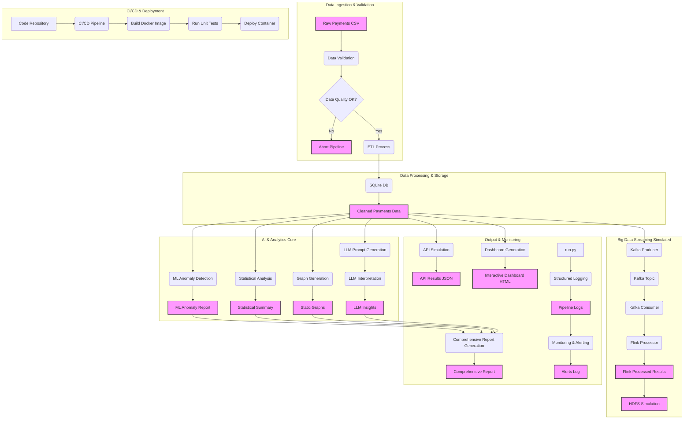

# RiskStreamML: Payment Anomaly Detection with LLM and Big Data

[](https://star-history.com/#Takk8IS/RiskStreamML&Date)
[](https://opensource.org/licenses/Apache-2.0)


## Overview

This project simulates a monthly payment processing pipeline, focused on anomaly detection, statistical analysis and visual report generation. It was designed to demonstrate a complete data and AI ecosystem, operating entirely offline. It uses SQLite as a local database and simulates interactions with Big Data components (Kafka, Flink, HDFS), Machine Learning (ML), Large Language Models (LLM), and MLOps/LLMOps, CI/CD and containerisation practices.

The central use case is that of a financial institution (bank, insurer, government) that processes benefits and needs to identify suspicious payments, such as duplicates for the same individual (identified by SSN) in the same period, or anomalous values.


The project integrates diverse layers and technologies (simulated) to offer a holistic view of a data and AI pipeline:

-   **ETL (Extract, Transform, Load)**: Processes payment data from a CSV file, performs cleaning and loads it into a SQLite database.
-   **Data Quality Validation**: Ensures the integrity and format of input data before processing, aborting the pipeline in case of critical failures.
-   **Duplicate Detection**: Identifies and reports duplicate payments for the same SSN in the same month, a primary indicator of anomaly.
-   **Machine Learning (Anomaly Detection)**: Employs the Isolation Forest algorithm to identify payments that deviate significantly from the pattern, signalling non-obvious anomalies.
-   **Statistical Analysis and Visualisation**: Calculates descriptive statistics and generates graphs (histograms, monthly trends) and summary tables for visual insights.
-   **Large Language Model (LLM) Simulated**: Emulates the capability of an LLM to interpret complex patterns in data, including statistics, duplicates and ML anomalies, providing a risk analysis in natural language.
-   **LLMOps/MLOps**: Implements essential practices such as structured logging (JSON), experiment tracking (via comprehensive report) and prompt versioning for the LLM, ensuring reproducibility and observability.
-   **Streaming Simulation (Apache Kafka)**: Simulates the sending and consuming of payment events in a streaming environment, demonstrating real-time processing capability.
-   **Stream Processing (Apache Flink Simulated)**: Simulates a Flink job that consumes events from Kafka, performs real-time aggregations (e.g.: payment count per beneficiary) and persists the results.
-   **Distributed Storage (Hadoop HDFS Simulated)**: Simulates the storage of Big Data processing results in a distributed file system, replicating the HDFS directory structure.
-   **Monitoring and Alerting (Simulated)**: Monitors the pipeline's structured logs for critical events (e.g.: anomaly detection, validation failures) and generates simulated alerts, essential for production system operation.
-   **REST API (Simulated)**: Exposes the consolidated results of risk analysis via a simulated REST endpoint, demonstrating how other applications can consume these insights.
-   **Interactive Dashboard (Static HTML)**: Generates an HTML file with interactive visualisations (using Plotly), allowing data exploration in a browser without the need for a server.
-   **Unit Tests**: Includes basic unit tests to ensure code correctness and quality, especially for critical modules such as data validation.
-   **Containerisation (Docker)**: Provides a `Dockerfile` to package the application and its dependencies in a container, ensuring portability and consistent execution environments.
-   **CI/CD (Simulated Jenkinsfile)**: Presents a `Jenkinsfile` as an example of Continuous Integration and Continuous Delivery pipeline, illustrating software lifecycle automation (build, test, run).

## AI Architecture and AI Engineering

This project was designed with a modular architecture, reflecting best practices in Data Engineering, Machine Learning Operations (MLOps) and Large Language Model Operations (LLMOps). The diagram below illustrates the data flow and interactions between the main pipeline components.



## Project Structure

```
├── README.md                 # Complete project documentation
├── requirements.txt          # Python project dependencies
├── Makefile                  # Command automator (build, run, clean, test, docker)
├── Dockerfile                # Definition for Docker image construction
├── Jenkinsfile               # CI/CD pipeline example (Jenkins)
│
├── sql/
│   └── init_db.sql           # SQL script for SQLite database initialisation
│
├── data/
│   └── payments_sample.csv   # Simulated payment data for input
│
├── src/
│   ├── config.py             # Global configurations and file paths
│   ├── db.py                 # Functions for connection and operations with SQLite
│   ├── etl.py                # Extract, Transform and Load data logic
│   ├── llm_analysis.py       # LLM analysis simulation and prompt versioning
│   ├── ml_analysis.py        # Anomaly detection with Machine Learning (Isolation Forest)
│   ├── kafka_producer.py     # Kafka event producer simulation
│   ├── kafka_consumer.py     # Kafka event consumer simulation
│   ├── flink_processor.py    # Apache Flink stream processing simulation
│   ├── graphs.py             # Graph generation and static visualisations
│   ├── reporting.py          # Comprehensive Markdown report generation
│   ├── logger.py             # Structured logging configuration in JSON
│   ├── data_validation.py    # Functions for input data quality validation
│   ├── monitoring.py         # Log monitoring simulation and alert generation
│   ├── api_simulator.py      # REST API simulation for results exposure
│   └── dashboard_generator.py# Interactive HTML dashboard generation
│
├── notebooks/
│   └── analysis.ipynb        # Jupyter notebook for exploratory analysis (optional)
│
├── hdfs_simulation/          # Directory to simulate HDFS file system
│
├── logs/                     # Directory to store structured pipeline logs
│
├── tests/                    # Directory for unit tests
│   └── test_data_validation.py # Unit test example for data validation
│
└── run.py                    # Main file that orchestrates the entire pipeline
```

## How to Run the Project

### Prerequisites

Make sure you have the following software installed in your environment:

-   [Python 3.8+](https://www.python.org/downloads/)
-   [pip](https://pip.pypa.io/en/stable/installation/) (Python package manager)
-   [make](https://www.gnu.org/software/make/) (optional, for command automation)
-   [Docker](https://docs.docker.com/get-docker/) (for containerisation)

### 1. Installing Dependencies

Use the `Makefile` to install all necessary Python libraries:

```bash
make install
```

Alternatively, you can install manually:

```bash
pip install -r requirements.txt
```

### 2. Running the Main Pipeline

To run the complete risk analysis pipeline, which includes ETL, ML, LLM, Big Data simulations, report generation and dashboards:

```bash
make run
```

Or run the main script directly:

```bash
python run.py
```

### 3. Cleaning Generated Artefacts

To remove all files generated by the pipeline (database, reports, graphs, logs, HDFS simulation):

```bash
make clean
```

### 4. Running with Docker

To build the application's Docker image:

```bash
docker build -t riskstreamml .
```

To run the application inside a Docker container. The volumes (`-v`) are used to persist output files in your local file system, even after the container is removed (`--rm`):

```bash
docker run --rm -v $(pwd)/output:/app/output -v $(pwd)/data:/app/data -v $(pwd)/logs:/app/logs -v $(pwd)/hdfs_simulation:/app/hdfs_simulation riskstreamml
```

### 5. Running Unit Tests

To run the project's unit tests and verify code correctness:

```bash
make test
```

## Detailed Execution Flow

The `run.py` file acts as the central orchestrator, coordinating the following steps:

1.  **Initialisation**: Configures the structured logger and cleans/initialises the SQLite database (`payments.db`) using `sql/init_db.sql`.
2.  **Data Extraction and Validation**: Reads raw data from `data/payments_sample.csv`. The `data_validation.py` module performs quality checks; the pipeline is aborted if critical problems are found.
3.  **ETL Processing**: The `etl.py` identifies and reports duplicate SSNs in the same month (`output/duplicate_ssns_report.txt`), and inserts the cleaned data into the database.
4.  **Analysis and Visualisation**: Data is read from the database. The `graphs.py` generates static visualisations (`output/payment_distribution.png`, `output/monthly_payment_trend.png`, `output/statistical_summary.png`).
5.  **Anomaly Detection (ML)**: The `ml_analysis.py` uses Isolation Forest to detect anomalies in payments, saving a specific report (`output/ml_anomaly_report.txt`).
6.  **Streaming Simulation (Kafka & Flink)**: The `kafka_producer.py` simulates the sending of payment events. The `kafka_consumer.py` simulates consumption, and the `flink_processor.py` simulates a Flink job that processes these events in real time (e.g.: count per beneficiary), saving the results in the simulated HDFS (`hdfs_simulation/user/data/flink_processed_results.txt`).
7.  **LLM Analysis**: The `llm_analysis.py` generates a versioned prompt with all statistics, duplicates and detected anomalies, and simulates an LLM's interpretation of the risks and insights.
8.  **Comprehensive Report Generation**: The `reporting.py` consolidates all analyses (statistics, duplicates, ML anomalies, LLM interpretation, MLOps/LLMOps parameters) into a detailed Markdown report (`output/comprehensive_analysis_report.md`).
9.  **Results Exposure (API & Dashboard)**: The `api_simulator.py` generates a JSON file (`output/api_results.json`) simulating the output of a REST API. The `dashboard_generator.py` creates an interactive HTML dashboard (`output/interactive_dashboard.html`) for easy visualisation.
10. **Monitoring and Alerting**: The `monitoring.py` simulates the scanning of pipeline logs (`logs/pipeline.log`) for critical events and generates an alert log (`output/alerts.log`).

## 🤝 Contributing

Contributions are welcome! Feel free to open issues or submit pull requests.

1. Fork the repository.
2. Create your feature branch (`git checkout -b feature/AmazingFeature`).
3. Commit your changes (`git commit -m 'Add some AmazingFeature'`).
4. Push to the branch (`git push origin feature/AmazingFeature`).
5. Open a Pull Request.

## 💡 Donations

If this project has been helpful, consider making a donation:

**USDT (TRC-20)**: `TP6zpvjt2ZNGfWKPevfp65ZrcbKMWSQXDi`

Your support helps us continue to develop innovative tools.

## 👥 About the Author

### 🧠 Takk™ Innovate Studio

- **Author**: David C Cavalcante
- **LinkedIn**: [David C Cavalcante](https://www.linkedin.com/in/hellodav/)
- **Medium**: [David C Cavalcante](https://medium.com/@davcavalcante/)
- **Positive results, rapid innovation**
- **Leading the Digital Revolution as the Pioneering 100% Artificial Intelligence Team**
- **URL**: [Takk](https://takk.ag/)
- **Twitter**: [Takk](https://twitter.com/takk8is/)
- **Medium**: [Takk](https://takk8is.medium.com/)

## Licence

This project is licensed under the [Apache 2.0 License](https://www.apache.org/licenses/LICENSE-2.0).
