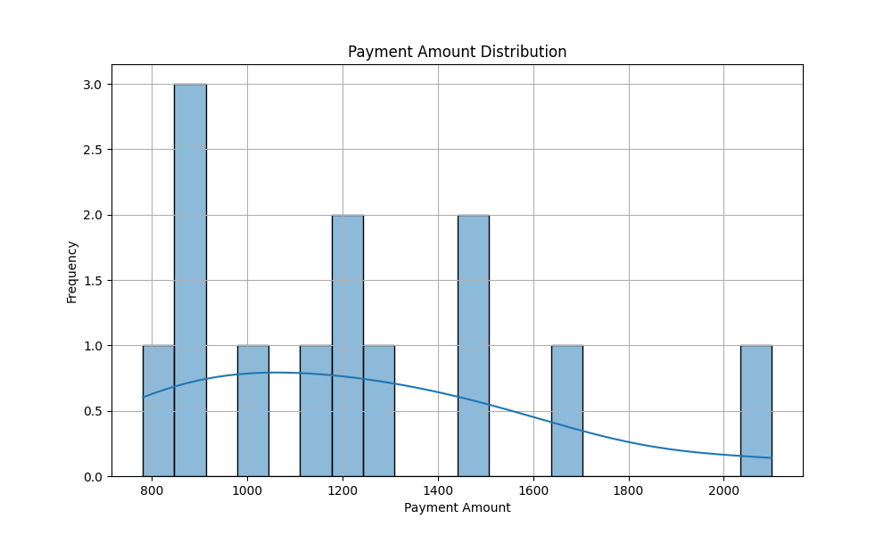
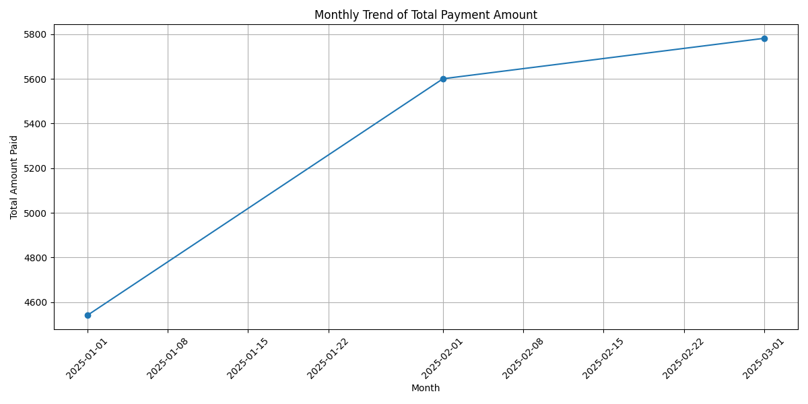
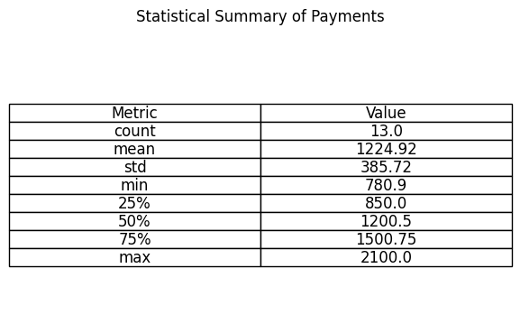

# Risk Analysis and LLMOps Report

*This report was generated to track the execution of the risk analysis pipeline.*

## 1. Execution Parameters (LLMOps & MLOps)

### 1.1. Machine Learning Model
- **Model:** Isolation Forest
- **Parameters:** `{'n_estimators': 100, 'contamination': 'auto', 'random_state': 42}`

### 1.2. LLM Analysis
- **Prompt Version:** `1.1`

## 2. General Summary

- **Total Processed Payments:** 13
- **Total Amount Paid:** $15,924.00
- **Average Payment Amount:** $1,224.92
- **Payment Median:** $1,200.50
- **Standard Deviation:** $385.72

## 3. Duplicate Detection

**4** suspicious duplicate transactions were found.

```
           ssn payment_date  amount         beneficiary_name payment_month
0  111-00-1111   2025-01-15  1200.5                 John Doe       2025-01
3  111-00-1111   2025-01-15  1200.5       John Doe Duplicate       2025-01
5  555-00-5555   2025-02-15  1150.0            Charles Brown       2025-02
9  555-00-5555   2025-02-15  1150.0  Charles Brown Duplicate       2025-02
```

## 4. Anomaly Detection (Machine Learning)

The ML model found **5** anomalous payments.

```
            ssn payment_date  amount   beneficiary_name
3   444-00-4444   2025-01-15   990.2      Mary Williams
6   666-00-6666   2025-02-15  2100.0    Patricia Miller
8   777-00-7777   2025-03-15   780.9       Robert Davis
9   888-00-8888   2025-03-15  1300.0       Linda Garcia
11  999-00-9999   2025-03-15  1650.4  Michael Rodriguez
```

## 5. LLM Analysis and Interpretation

> 
>     **Comprehensive Risk Analysis:**
> 
>     **Points of Concern:**
>     1.  **Critical Duplicates:** The presence of duplicate SSNs in the same month is a strong indicator of fraud or serious systemic error. Requires immediate action.
>     2.  **Value Anomalies:** The ML model flagged payments with values that, whilst not duplicated, deviate significantly from the pattern. The payment of $2100.00 to SSN 666-00-6666 is a clear example, being much higher than the average.
>     3.  **High Variability:** The elevated standard deviation relative to the mean suggests that there are different payment categories or significant outliers, which may complicate the detection of subtle fraud.
> 
>     **Recommended Next Steps:**
>     - **Immediate Investigation:** Contact the beneficiaries associated with duplicate SSNs to validate the transactions.
>     - **Anomaly Audit:** Review the payments flagged by the ML model to determine if they are legitimate (e.g. backdated payments) or fraudulent.
>     - **Model Refinement:** Consider adding more features to the ML model (e.g. beneficiary history, location) to improve anomaly detection accuracy.
>     

## 6. Visualisations

### Value Distribution


### Monthly Trend


### Statistical Summary

